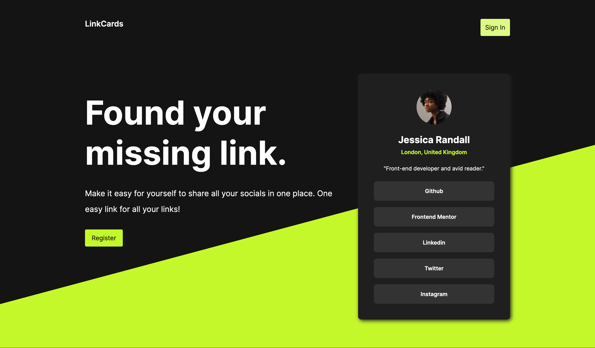

# LinkCards

LinkCards is a service that allows users to display their most important social media presences in one place! Easily editable and shareable, this service is convenient for developers and non-developers alike.

Users can connect their accounts to their LinkedIn profile in order to create their profile pictures.

[View production app](https://www.linkcards.bio/)

## Features

- Share links to all your socials in one place (e.g. https://linkcards.bio/jessica1)

## Built With

### Frontend:
* [React](https://react.dev/) - The frontend framework used
* [React Router](https://reactrouter.com/en/main) - Library for managing page rendering
* [CSS Modules](https://github.com/css-modules/css-modules) - Used to selectively style components

### Backend
* [Node.js](https://nodejs.org/en) - The Javascript runtime
* [Express](https://expressjs.com/) - The backend framework used
* [MongoDB](https://www.mongodb.com/) - BSON Database
* [PassportJS](https://www.passportjs.org/) - Authentication framework
* [BCrypt](https://github.com/kelektiv/node.bcrypt.js) - Used to securely hash and salt passwords
* [csrf-sync](https://github.com/Psifi-Solutions/csrf-sync) - Used to implement synchronized CSRF protection

## Authors

* **Nicholas Boyce** - [nicholasboyce](https://github.com/nicholasboyce)

## Acknowledgments

* Frontend Mentor for the initial card design!
