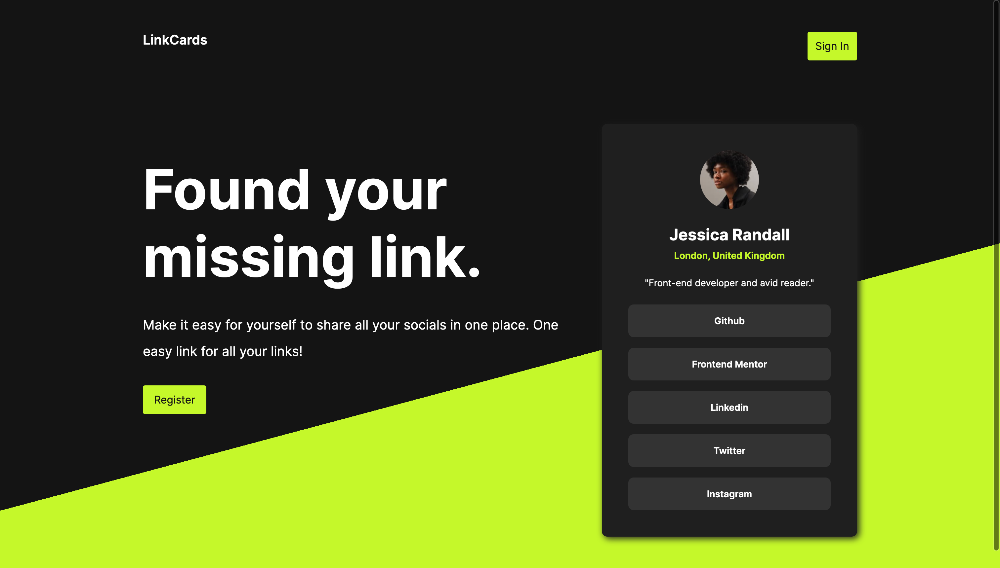

# LinkCards



LinkCards is a service that allows users to display their most important social media presences in one place! Easily editable and shareable, this service is convenient for developers and non-developers alike.

Users can connect their accounts to their LinkedIn profile in order to create their profile pictures.

[View production app](https://www.linkcards.bio/)

## Features

- Share links to all your socials in one place (e.g. https://linkcards.bio/jessica1)

## Getting Started

These instructions will get you a copy of the project up and running on your local machine for development and testing purposes. See deployment for notes on how to deploy the project on a live system.

### Installing

Clone or fork this repository to make sure you have the files locally.
```console
git clone https://github.com/nicholasboyce/linkcards.git
```

Note: This project manages dependencies using pnpm. Install pnpm if you don't already have it.
```console
npm i -g pnpm
```

You'll need to set up MongoDB and Redis in order to get the proper functionality of this app. I recommend using Docker.

You'll also need to set up your environment variables. Please see the example.env file in the server folder. Once you've entered all the necessary values, change it to .env so that it can be read by the app. 

1. Change directory into the 'frontend' folder and install the dependencies.
```console
cd frontend && pnpm install
```

2. Build the files so that they can be optimized and served from the backend.
```console
pnpm run build
```

3. Switch directory to the server folder and install the dependencies.
```console
cd ../server && pnpm install
```

4. To start the development server, run
```console
pnpm run dev
```

and for the production server, run
```console
pnpm run start
```

You should see in the console logs of either case that the server is successfully listening on the PORT you specified, and that it has successfully connected to MongoDB. 

Note: The Dockerfile is used for production deployment. This file is not currently meant to be used for local development. A file for other users is forthcoming.

## Running the Tests
You can currently run the tests for the API service with
```console
pnpm run test
```

LinkCards uses the native Node test runner for the backend.

## Built With

### Frontend:
* [React](https://react.dev/) - The frontend framework used
* [React Router](https://reactrouter.com/en/main) - Library for managing page rendering
* [CSS Modules](https://github.com/css-modules/css-modules) - Used to selectively style components

### Backend
* [Node.js](https://nodejs.org/en) - The Javascript runtime
* [Express](https://expressjs.com/) - The backend framework used
* [MongoDB](https://www.mongodb.com/) - BSON Database
* [PassportJS](https://www.passportjs.org/) - Authentication framework
* [BCrypt](https://github.com/kelektiv/node.bcrypt.js) - Used to securely hash and salt passwords
* [csrf-sync](https://github.com/Psifi-Solutions/csrf-sync) - Used to implement synchronized CSRF protection

## Authors

* **Nicholas Boyce** - [nicholasboyce](https://github.com/nicholasboyce)

## Acknowledgments

* Frontend Mentor for the initial card design!
